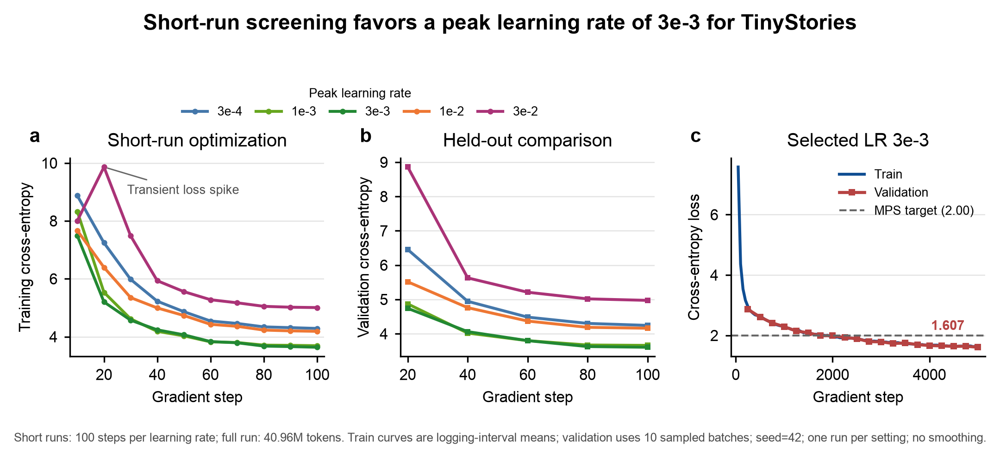
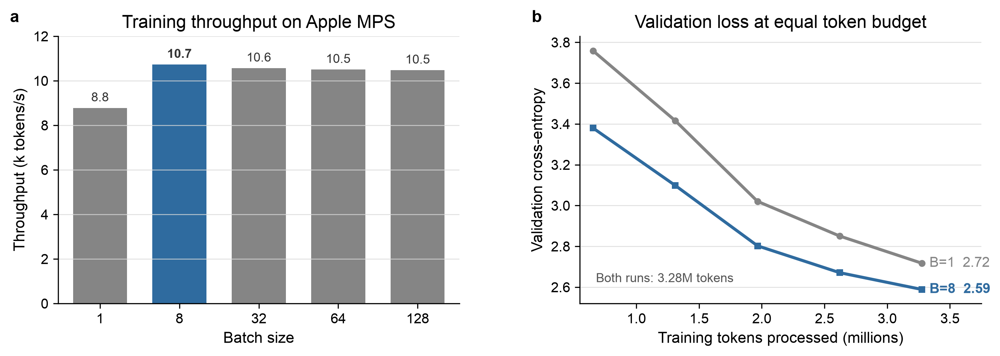
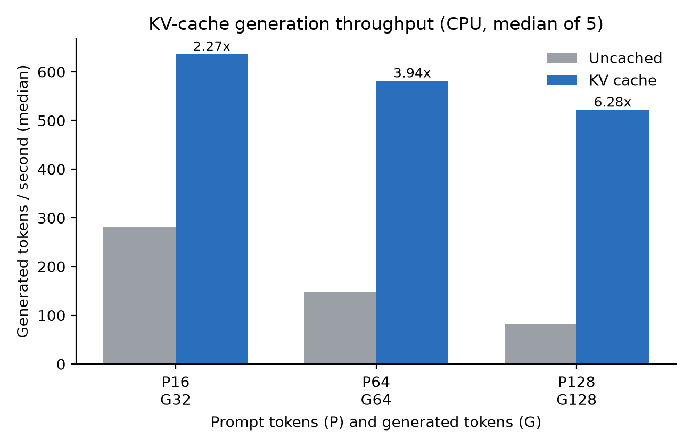

# From-Scratch Language Model

This project builds a small decoder-only language model from byte-level
tokenization through Transformer training and inference.

The project implements the core architecture and training stack from first
principles, including RMSNorm, RoPE, causal multi-head attention, SwiGLU,
AdamW, checkpointing, temperature/top-p decoding, and KV-cache inference.
On TinyStories, the selected model reached a validation loss of 1.607 after
training on 40.96M tokens on Apple MPS.

## Example Generation

**Prompt:** `Once upon a time`

> Once upon a time, there was a little girl named Lily. She loved to play with
> her toys and eat yummy food. One day, she found a big, red apple in the
> kitchen. She was very happy and wanted to eat it all by herself.
>
> Lily's mom saw her looking at the apple and said, "Lily, you can have a big
> apple if you promise to share your food with your friends." Lily thought about
> it and decided to share her apple with her friends. They all took turns eating
> the apple and having fun.
>
> As they played, Lily's friends came to join them. They all played together and
> had a great time. Lily learned that sharing is good and makes everyone happy.
> And that was the moral of the story: sharing with others can make everyone
> happy.

## Learning-Rate Study



A controlled 100-step screen compared peak learning rates of `3e-4`, `3e-3`,
and `3e-2`. The `3e-3` run achieved the lowest final validation loss in the
screen and was selected for the full 5,000-step training run.

The selected model processed 40.96M tokens and reached a final sampled
validation loss of **1.607**.

## TinyStories Batch-Size Result



Batch 8 delivered the highest final logged throughput on Apple MPS: 10,732
tokens/s. In the only matched-token comparison, both runs processed 3.28M
training tokens and batch 8 reached validation loss 2.589 versus 2.717 for
batch 1.

## KV-Cache Inference Result



On CPU with the selected 22.7M-parameter checkpoint, cached generation reached
2.27x, 3.94x, and 6.28x the corresponding uncached throughput. Each value is
the median of five measured repeats after two warmups.

## Repository Guide

| Path                              | Purpose                                                         |
| --------------------------------- | --------------------------------------------------------------- |
| `cs336_basics/tokenizer.py`     | BPE training and tokenizer implementation                       |
| `cs336_basics/model.py`         | Transformer building blocks                                     |
| `cs336_basics/data.py`          | Language-model batch sampling                                   |
| `cs336_basics/serialization.py` | Training checkpoint save/load utilities                         |
| `cs336_basics/training.py`      | Validation and end-to-end training loop                         |
| `cs336_basics/generation.py`    | Temperature-scaled and top-p decoding                           |
| `scripts/benchmark_kv_cache.py` | Cached/uncached inference benchmark                             |
| `scripts/`                      | Tokenizer training, evaluation, and dataset encoding            |
| `tests/adapters.py`             | Connection between local implementations and assignment tests   |
| `docs/decisions/`               | Architecture decision records                                   |
| `docs/assets/`                  | Version-controlled figures used by the public README            |
| `results/`                      | Small, version-controlled source-data tables for public figures |

## Quick Start

Install [`uv`](https://docs.astral.sh/uv/getting-started/installation/), clone
the repository, and let `uv` create the environment and install dependencies:

```sh
uv sync
uv run pytest -q
```

Raw datasets, encoded arrays, tokenizer files, and checkpoints are reproducible
local artifacts and are excluded from version control. After downloading the
TinyStories corpus, use the preprocessing scripts in [`scripts/`](./scripts/)
to train the tokenizer and create the encoded arrays.

### Train the selected TinyStories configuration

The following configuration produced the 5,000-step model with a sampled
validation loss of 1.607. Architecture parameters omitted here use the defaults
defined in `scripts/train.py`.

```sh
uv run scripts/train.py \
  --train-data output/encoded/tinystories_train_ids.npy \
  --validation-data output/encoded/tinystories_valid_ids.npy \
  --checkpoint-path checkpoints/tinystories_base_lr_3e-3_5000.pt \
  --vocab-size 10000 \
  --max-learning-rate 3e-3 \
  --warmup-iterations 500 \
  --cosine-cycle-iterations 5000 \
  --max-iterations 5000
```

The script automatically selects CUDA, MPS, or CPU. Run
`uv run scripts/train.py --help` to view every available setting.

### Generate a story

```sh
uv run scripts/generate.py \
  --checkpoint-path checkpoints/tinystories_base_lr_3e-3_5000.pt \
  --vocab-path output/tokenizer/tinystories_vocab.pkl \
  --merges-path output/tokenizer/tinystories_merges.pkl \
  --prompt "Once upon a time" \
  --max-new-tokens 200 \
  --temperature 0.8 \
  --top-p 0.9
```

Generation uses the KV cache by default and stops at `<|endoftext|>` or the
requested token limit. Set `--temperature 0` for deterministic greedy decoding,
or pass `--uncached` to run the full-prefix baseline.

Benchmark, evaluation, and plotting commands are documented through each
script's `--help`; measured configurations and interpretations are recorded in
[`EXPERIMENTS.md`](./EXPERIMENTS.md).

## Attribution

This repository is based on Stanford CS336 Assignment 1. The assignment
specification, starter interfaces, tests, fixtures, and handout originate from
the course materials. The implementations, optimization work, experiment
records, explanatory documentation, and planned personal-memory extensions are
developed in this project.
